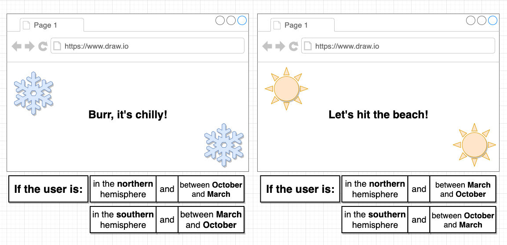

# Seasons App

It seems like a silly application doesn't really have a huge purpose to it but nonetheless, it's going to be a simple application.
That's going to make it very easy to understand exactly how class-based components work and how state works and lifecycle methods work.

## App Challenges
1. Need to get the users physical location
2. Need to determine the current month
3. Need to change text and styling based on location and month

## User Stories
---
* Well, it's going to be an application that is going to detect what season the user is currently experiencing outside like in the real world.
* So if the user is located in the northern hemisphere that means it has to actually detect the user’s physical location when they visit application.
* So if they're in the northern hemisphere and it's between October and March then it's probably going to be winter.
* So it will print on the screen something like Burr, it's chilly! and shows some snowflake icons.
* If the user is in the southern hemisphere so they are visiting application from any location on the earth in the southern hemisphere and the month is between March and October. That means it's winter for them.
* People in the southern hemisphere and so I also want to show birr it's chilly.
And then for the obvious reverse cases.
* So the case in which it is a user is in the northern hemisphere and it's between March and October.
I want to print up something that seems to indicate that it is currently summertime and maybe it's time
to hit the beach or something like that.
* So essentially it is just detecting what season it is based on the user's location and their current time or what month it is.
Now it’s going to print some different content on the screen based upon that.

* It seems like a silly application but there's going to be a ton of hidden challenges inside of here that are going to require to get a much better understanding of how React.js works.

## Technologies Used
---
* React.js
* semantic-ui.com